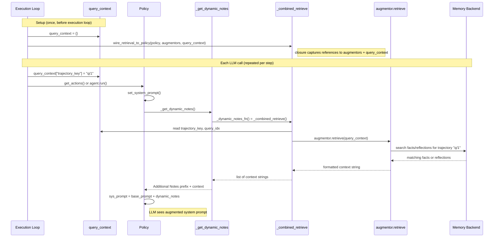

# Context Augmentor Framework

## Overview

The Context Augmentor framework enables LLM agents to **learn from experience** during multi-trajectory reasoning. Each augmentor follows a core cycle:

1. **Analyze** (`analyze()`) — after a step or trajectory completes, extract knowledge from the execution (facts, reflections, error patterns)
2. **Store** (`store()` / `_buffer`) — persist the extracted knowledge for later use
3. **Retrieve** (`retrieve()`) — before each LLM call, fetch relevant knowledge and inject it into the policy prompt

This cycle is the same for all augmentors — they differ only in *what* they extract and *how* they store/retrieve:

| Augmentor | What it extracts (analyze) | How it stores | What it injects (retrieve) |
|-----------|---------------------------|---------------|---------------------------|
| FactMemoryAugmentor | Atomic facts from observations | Vector-indexed memory backend | Similar facts from prior trajectories |
| ReflectionAugmentor | Strategy-level summary of failed trajectory | In-memory buffer + jsonl | Recent reflections |
| CriticAugmentor | LLM advice on current trajectory | In-memory buffer + jsonl | Latest critic |
| SQLValidator | SQL syntax/semantic issues | jsonl | Historical issues |
| SQLErrorProfiler | Error patterns across trajectory | jsonl | Error pattern summaries |

All augmentors inherit from the `ContextAugmentor` ABC (`lits/components/context_augmentor/__init__.py`).
See §3.4 (Persistence and the Augmentor Pipeline) of the paper for the formal pipeline definition.

## Architecture

### Base Class: ContextAugmentor

All augmentors inherit from the `ContextAugmentor` ABC, which provides:

- **Unified file management**: All augmentors for the same policy/task save to the same file
- **Automatic metadata**: Adds `evaluator_type` and `timestamp` to all saved results
- **Result filtering**: Load results by evaluator type
- **Common interface**: `analyze()`, `evaluate()`, `retrieve()`, `store()` methods

```python
from lits.components.context_augmentor import ContextAugmentor

class MyAugmentor(ContextAugmentor):
    def _analyze(self, input, **kwargs) -> Optional[dict]:
        """Analyze input and return result dict with 'issues' key."""
        # Implementation
```

### Unified Interface

All verbal evaluators implement a common `evaluate()` method:

```python
def evaluate(self, input, **kwargs) -> Optional[str]:
    """Evaluate input and return a single issue string for policy feedback.
    
    Returns:
        Single string describing the issue and how to avoid it, or None if no issues
    """
```

This unified interface allows policies to use any evaluator consistently:

```python
# Works with any evaluator
issue = evaluator.evaluate(input, policy_model_name="gpt-4", task_type="spatial_qa")
if issue:
    policy.base_model.sys_prompt += f"\n\n**Note:** {issue}"
```

### Unified Issue Storage

**Key Feature:** All evaluators for the same policy model and task type save to the **same file**.

File location:
```
~/.lits_llm/context_augmentor/resultdicttojsonl_{model}_{task}.jsonl
```

Each record contains:
```json
{
  "evaluator_type": "sqlvalidator",
  "query_idx": 0,
  "issue": "Description of what went wrong and why",
  "timestamp": "2024-12-03 10:30:45",
  ...additional evaluator-specific fields...
}
```

**Benefits:**
- Single file per policy/task combination
- Easy to track all issues in one place
- `evaluator_type` field distinguishes which evaluator generated each result
- Simplified file management and loading

## Current Implementations

### Augmentor Catalog

| Augmentor | Trigger | LLM? | Use Case |
|-----------|---------|------|----------|
| `FactMemoryAugmentor` | per-step (or batch) | No (backend LLM) | Cross-trajectory fact extraction and retrieval |
| `CriticAugmentor` | per-step | Yes | LLM advice on current trajectory |
| `ReflectionAugmentor` | per-trajectory | Yes | LLM reflection on failed trajectories |
| `SQLValidator` | per-step | No | SQL syntax/semantic validation |
| `SQLErrorProfiler` | per-trajectory | Yes | SQL error pattern analysis |

### Wiring Architecture

Augmentors are connected to the execution loop through two mechanisms:
**dynamic notes injection** (retrieval → policy system prompt via `_dynamic_notes_fn`) and **analysis callbacks** (execution events → augmentor analysis).
Both mechanisms share a mutable `query_context` dict that tracks the current position in the search/attempt space.

Note: dynamic notes currently inject into the **policy** system prompt only. The framework's prompt spec system (`lits/prompts/`, see [ADDING_PROMPTS.md](../../prompts/ADDING_PROMPTS.md)) supports prompts for policy, reward model, and transition, but augmentor context injection to reward/transition is not yet implemented (see `target=policy+reward` in the design spec `0312-major-context-augmentation/design.md`).

#### Shared: `query_context` and prompt injection

`query_context` is a mutable dict created once before the execution loop. It serves two purposes:

1. **Runtime routing** (updated per-attempt/iteration, read by the closure on every LLM call): `trajectory_key`, `query_idx`, `query_or_goals`. These tell augmentors *which* trajectory's context to retrieve.
   - Set by: `chain.py::_run_tool_use` (per-attempt) / `mcts.py::MCTSSearch.search` (per-iteration)
   - Read by: `augmentor_setup.py::_combined_retrieve` closure → `augmentor.retrieve(query_context)`

2. **One-time configuration** (set at setup, read once by `set_storage_context`): `policy_model_name`, `task_type`, `save_dir`. These configure where augmentors persist their data. They are consumed during `wire_retrieval_to_policy` and stored on each augmentor instance — not read from `query_context` again afterward.
   - Set by: `chain.py::_run_tool_use` (at setup) / `mcts.py::MCTSSearch.search` (at setup)
   - Read by: `augmentor_setup.py::wire_retrieval_to_policy` → `ContextAugmentor.set_storage_context()` (`__init__.py`)
   - Consumed by: `ContextAugmentor._get_result_saver()` (`__init__.py`) for jsonl persistence path; `ReflectionAugmentor._load_persisted_units()` (`reflection.py`) for loading historical reflections

The dict is passed by reference to `wire_retrieval_to_policy()`, which creates a [closure](https://docs.python.org/3/faq/programming.html#why-am-i-getting-an-unboundlocalerror-when-the-variable-has-a-value) — an inner function (`_combined_retrieve`) that captures the dict reference. The execution loop updates the runtime keys before each LLM call; the closure reads the current values when invoked.

This pattern is shared by both `lits-search` and `lits-chain`:



**What gets injected is NOT `query_context` itself.** `query_context` is a routing parameter — it tells the augmentor *which* trajectory's context to retrieve. The injected content is the **return value of `augmentor.retrieve()`**: formatted text from the memory backend (facts, reflections, etc.).

Complete call chain with code references:

| Step | Code location | What happens |
|------|--------------|-------------|
| 1. Update context | `chain.py` attempt loop / `mcts.py` search loop | `query_context["trajectory_key"] = "q/{attempt}"` |
| 2. Trigger | `base.py::Policy.get_actions()` | Calls `self.set_system_prompt()` |
| 3. Build prompt | `native_tool_use.py::set_system_prompt()` | `base_prompt = self._build_system_prompt()` |
| 4. Get notes | `base.py::Policy._get_dynamic_notes()` | Calls `self._dynamic_notes_fn()` → the closure |
| 5. Retrieve | `augmentor_setup.py::_combined_retrieve()` | Iterates augmentors, calls `aug.retrieve(query_context)` |
| 6. Search | `fact_memory.py::retrieve()` or `reflection.py::retrieve()` | Uses `query_context["trajectory_key"]` to find relevant content |
| 7. Format | augmentor's `retrieve()` | Returns formatted string (e.g., `"# Lessons from previous attempts\n- ..."`) |
| 8. Inject | `base.py::_get_dynamic_notes()` | Wraps with `"\n\nAdditional Notes:\n"` prefix |
| 9. Set | `native_tool_use.py::set_system_prompt()` | `self.base_model.sys_prompt = base_prompt + dynamic_notes` |
| 10. Send | `bedrock_chat.py::_converse_api()` | `sys_prompt` sent as Converse API `system` field |

**Keys in `query_context`:**

| Key | Updated by | Read by | Purpose |
|-----|------------|---------|---------|
| `trajectory_key` | chain: per-attempt (`q/{attempt}`); search: per-iteration | `FactMemoryAugmentor.retrieve()`, `ReflectionAugmentor.retrieve()` | Current trajectory for cross-trajectory retrieval |
| `query_idx` | chain: per-attempt; search: per-example | `FactMemoryAugmentor.retrieve()` | Example index → `search_id` construction |
| `query_or_goals` | chain: per-attempt; search: per-example | `ReflectionAugmentor.retrieve()` | Task question for history-access filtering |
| `policy_model_name` | chain: at setup; search: at setup | `set_storage_context()`, `ReflectionAugmentor._load_persisted_units()` | Model name for storage paths and jsonl persistence |
| `task_type` | chain: at setup (`benchmark_name`); search: at setup | `set_storage_context()`, `ReflectionAugmentor._load_persisted_units()` | Task type for storage paths and jsonl persistence |
| `save_dir` | chain: at setup (`result_dir/augmentor`); search: not set (uses default `~/.lits_llm/`) | `set_storage_context()` → `_get_result_saver()` | Override persistence directory |

#### API functions (`augmentor_setup.py`)

| Function | Used by | What it does |
|----------|---------|-------------|
| `wire_retrieval_to_policy(policy, augmentors, query_context)` | both | Registers `_combined_retrieve` closure on policy's dynamic notes |
| `build_search_callbacks(augmentors, query_context)` | search only | Returns `(on_step_complete, on_trajectory_complete)` callbacks |
| `setup_augmentors(policy, augmentors, query_context)` | search only | Convenience wrapper: calls both of the above |

#### `lits-search` specifics

Uses `setup_augmentors()` which calls both `wire_retrieval_to_policy` and `build_search_callbacks`. The two callbacks are invoked by the MCTS/BFS loop:
- `on_step_complete(step, node, query_idx)` — after each child node transition in `_expand()`. Triggers per-step augmentors (FactMemoryAugmentor, CriticAugmentor, SQLValidator).
- `on_trajectory_complete(path, reward, query_idx)` — after backpropagation. Triggers per-trajectory augmentors (ReflectionAugmentor, SQLErrorProfiler).

`query_context` is updated by the search loop before each iteration (trajectory_key changes as the tree is explored).

#### `lits-chain` specifics

Uses `wire_retrieval_to_policy()` only (no search callbacks). Analysis is done explicitly after each attempt:

```python
# After attempt completes + verify
_analyze_trajectory(augmentors, state, example_idx, attempt, run_logger,
                    reward=attempt_reward, query_or_goals=query)
```

`query_context` is updated at the start of each attempt (trajectory_key = `q/{attempt}`). Memory is cleared between examples via `_clear_memory()` (FactMemoryAugmentor only).

### 1. FactMemoryAugmentor

**Purpose:** Cross-trajectory fact extraction and retrieval via `LiTSMemoryManager`.

**Modes:**
- `batch=False` (default): Incremental — processes `traj_state[-1]` only. Used by tree search.
- `batch=True`: Batch — concatenates all steps' messages into one LLM call. Used by chain pass@N. Produces better facts (LLM sees full context) and is cheaper (1 call vs N).

**CLI:** `--memory-arg backend=local augmentors=fact`

### 2. CriticAugmentor

**Purpose:** Per-step LLM advice on the current trajectory.

### 3. ReflectionAugmentor

**Purpose:** Per-trajectory LLM reflection on failed trajectories (reward below threshold).

**CLI:** `--memory-arg augmentors=fact,reflection`

See [REFLECTION.md](./REFLECTION.md) for detailed documentation including reward semantics, chain vs tree search setup, and code references.

### 4. SQLValidator

**Purpose:** Step-level validation of individual SQL queries

**Input:** Single `ToolUseStep` containing a SQL action

**Output:** Validation result with specific issue

**Use Case:** Real-time validation during policy execution

**Example:**
```python
from lits.components.context_augmentor import SQLValidator
from lits.lm import get_lm

# Initialize
llm = get_lm("gpt-4")
validator = SQLValidator(
    base_model=llm,
    sql_tool_names=['sql_db_query', 'sql_query']
)

# Evaluate a step
issue = validator.evaluate(
    step,
    context="PostGIS database with psr_point, psr_polygon tables",
    user_intent="Find priority sites",
    query_idx=0,
    policy_model_name="gpt-4",
    task_type="spatial_qa"
)

if issue:
    print(f"Issue detected: {issue}")
    # Issue automatically saved to file
```

**Validation Criteria:**
- SQL syntax correctness
- Semantic validity (table/column references)
- Spatial commonsense (PostGIS functions, CRS logic)
- Safety (no destructive operations)
- Intent alignment

**Output Format:**
```python
# evaluate() returns:
"Using geometry in EPSG:4326 with meter-level distance thresholds causes incorrect results..."

# validate() returns full dict:
{
    'is_valid': False,
    'score': 0.3,
    'reasoning': "...",
    'issue': "Using geometry in EPSG:4326...",
    'query_idx': 0
}
```

### 5. SQLErrorProfiler

**Purpose:** Trajectory-level analysis of SQL error patterns

**Input:** Entire `TrajectoryState` (sequence of steps)

**Output:** Structured error profile with pattern analysis

**Use Case:** Post-hoc analysis to identify recurring issues

**Example:**
```python
from lits.components.context_augmentor import SQLErrorProfiler
from lits.structures import ToolUseState

# Initialize
profiler = SQLErrorProfiler(base_model=llm)

# Load trajectory from checkpoint
query, state = ToolUseState.load("checkpoint.json")

# Evaluate trajectory
issue = profiler.evaluate(
    state,
    query_idx=0,
    policy_model_name="gpt-4",
    task_type="spatial_qa"
)

if issue:
    print(f"Pattern detected: {issue}")
```

**Analysis Includes:**
- Both successful and failed steps
- Error type classification
- Principle-based issues (what + why)
- Comparison of what worked vs. what failed

**Output Format:**
```python
# evaluate() returns:
"Schema mismatch errors: Querying non-existent tables due to lack of schema validation..."

# profile_trajectory() returns full dict:
{
    'error_type': 'Schema mismatch errors',
    'issues': [
        "Querying non-existent tables due to lack of schema validation",
        "Using 'geometry' column which failed, instead of 'geom' which succeeded in Step 5"
    ],
    'query_idx': 0
}
```

## Comparison

| Feature | SQLValidator | SQLErrorProfiler |
|---------|-------------|------------------|
| **Scope** | Single step | Entire trajectory |
| **Input** | ToolUseStep | TrajectoryState |
| **Timing** | Real-time | Post-hoc |
| **Focus** | Specific query | Error patterns |
| **Analysis** | Syntax, semantics | Patterns, comparisons |
| **Output** | Specific issue | Generalized insights |
| **Use Case** | Prevent errors | Learn from errors |

## Loading Issues for Policy Feedback

Both evaluators provide methods to load historical issues:

### SQLValidator

```python
# Load recent issues
feedback = validator.load_issues_as_prompt(
    policy_model_name="gpt-4",
    task_type="spatial_qa",
    max_issues=10
)

# Inject into policy
policy.base_model.sys_prompt += "\n\n" + feedback
```

Output format:
```
**Previous SQL Errors to Avoid:**

1. Using geometry in EPSG:4326 with meter-level distance thresholds...
2. Querying non-existent tables without schema validation...
```

### SQLErrorProfiler

```python
# Load recent profiles
feedback = profiler.load_profiles_as_prompt(
    policy_model_name="gpt-4",
    task_type="spatial_qa",
    max_profiles=5
)

# Inject into policy
policy.base_model.sys_prompt += "\n\n" + feedback
```

Output format:
```
**Previous SQL Error Patterns to Avoid:**

1. Error Type: Schema mismatch errors
   Key Issues:
   - Querying non-existent tables due to lack of schema validation
   - Using incorrect column names from assumptions about structure

2. Error Type: Spatial CRS errors
   Key Issues:
   - Using geometry with meter-based distances in EPSG:4326
```

## Integration Patterns

### Pattern 1: Real-time Validation

```python
# During policy execution
for step in policy.get_actions(state, query):
    # Validate before execution
    issue = validator.evaluate(step, context=schema, 
                               policy_model_name=model_name,
                               task_type=task_type)
    
    if issue:
        logger.warning(f"Invalid action: {issue}")
        continue  # Skip invalid action
    
    # Execute valid action
    new_state = transition.step(state, step.action)
```

### Pattern 2: Post-hoc Learning

```python
# After trajectory completion
issue = profiler.evaluate(final_state,
                         policy_model_name=model_name,
                         task_type=task_type)

if issue:
    # Load accumulated feedback
    feedback = profiler.load_profiles_as_prompt(model_name, task_type)
    
    # Update policy for next run
    policy.base_model.sys_prompt += "\n\n" + feedback
```

### Pattern 3: Hybrid Approach

```python
# Combine both evaluators
validator = SQLValidator(base_model=llm, sql_tool_names=tools)
profiler = SQLErrorProfiler(base_model=llm)

# Real-time validation during execution
for step in steps:
    issue = validator.evaluate(step, ...)
    if issue:
        handle_invalid_step(step, issue)

# Post-hoc analysis after completion
trajectory_issue = profiler.evaluate(final_state, ...)
if trajectory_issue:
    update_policy_with_patterns(trajectory_issue)
```

## File Organization

**Unified Storage:** All evaluators for the same policy/task save to one file.

```
~/.lits_llm/context_augmentor/
├── resultdicttojsonl_gpt-4_spatial_qa.jsonl          # Both SQLValidator AND SQLErrorProfiler
├── resultdicttojsonl_claude_tool_use.jsonl           # Both evaluators
└── resultdicttojsonl_llama-3_math_qa.jsonl           # Both evaluators
```

**File naming:** `resultdicttojsonl_{model_name}_{task_type}.jsonl`

Files are automatically created and appended to based on:
- Policy model name (e.g., "gpt-4", "claude-3.5-sonnet")
- Task type (e.g., "spatial_qa", "tool_use")

**Record format:**
```json
{
  "evaluator_type": "sqlvalidator",
  "query_idx": 0,
  "issue": "Using geometry in EPSG:4326...",
  "is_valid": false,
  "score": 0.3,
  "timestamp": "2024-12-03 10:30:45"
}
```

```json
{
  "evaluator_type": "sqlerrorprofiler",
  "query_idx": 1,
  "error_type": "CRS mismatch errors",
  "issues": ["Using geometry with meter-based distances..."],
  "timestamp": "2024-12-03 10:35:12"
}
```

The `evaluator_type` field distinguishes which evaluator generated each result.

## Best Practices

### 1. Use Descriptive Model/Task Names

```python
# Good
policy_model_name = "gpt-4-turbo"
task_type = "spatial_qa_postgis"

# Avoid
policy_model_name = "model1"
task_type = "task"
```

### 2. Provide Rich Context

```python
# Good
context = """
PostGIS database with tables:
- psr_point(gid, geom, address, issue)
- psr_polygon(gid, geom, address, issue)
Geometry column: 'geom' (not 'geometry')
CRS: EPSG:4283
"""

# Avoid
context = "PostGIS database"
```

### 3. Regular Feedback Updates

```python
# Load feedback periodically
if iteration % 10 == 0:
    feedback = validator.load_issues_as_prompt(model_name, task_type)
    policy.base_model.sys_prompt = base_prompt + "\n\n" + feedback
```

### 4. Monitor Issue Files

```python
from pathlib import Path

issue_file = Path.home() / ".lits_llm" / "context_augmentor" / f"resultdicttojsonl_{model}_{task}.jsonl"

if issue_file.exists():
    with open(issue_file) as f:
        issue_count = sum(1 for _ in f)
    print(f"Total issues logged: {issue_count}")
```

## Extending the Framework

To create a new augmentor, inherit from `ContextAugmentor`:

### 1. Inherit from Base Class

```python
from lits.components.context_augmentor import ContextAugmentor
from typing import Optional

class MyCustomAugmentor(ContextAugmentor):
    """Custom augmentor for analyzing X."""
    
    def __init__(self, base_model, custom_param: str, **kwargs):
        super().__init__(
            base_model=base_model,
            require_chat_model=True,
            temperature=kwargs.get('temperature', 0.0),
            max_new_tokens=kwargs.get('max_new_tokens', 500)
        )
        
        self.custom_param = custom_param
        # evaluator_type is automatically set to 'mycustomaugmentor'
```

### 2. Implement Required Methods

```python
    def evaluate(self, input, **kwargs) -> Optional[str]:
        """Evaluate input and return issue string.
        
        Args:
            input: The input to evaluate
            query_idx: Optional query index
            policy_model_name: Policy model name (for saving)
            task_type: Task type (for saving)
            **kwargs: Additional parameters
        
        Returns:
            Single issue string, or None if no issues
        """
        # Your evaluation logic
        result = self._analyze(input)
        
        # Save if policy info provided
        if result and kwargs.get('policy_model_name') and kwargs.get('task_type'):
            save_result = {
                'issue': result['issue'],
                'custom_field': result.get('custom_field')
            }
            self._save_eval(
                save_result,
                kwargs.get('query_idx'),
                kwargs['policy_model_name'],
                kwargs['task_type']
            )
        
        # Return single issue string
        return result.get('issue') if result else None
    
    def load_eval_as_prompt(
        self,
        policy_model_name: str,
        task_type: str,
        max_items: int = 10
    ) -> str:
        """Load saved evaluations as prompt.
        
        Args:
            policy_model_name: Policy model name
            task_type: Task type
            max_items: Maximum number of items to include
        
        Returns:
            Formatted prompt string
        """
        # Load results filtered by this evaluator type
        results = self.load_results(
            policy_model_name,
            task_type,
            evaluator_type=self.evaluator_type
        )
        
        if not results:
            return ""
        
        # Get recent items
        recent = results[-max_items:]
        
        # Format as prompt
        prompt_parts = ["**Previous Issues:**\n"]
        for idx, record in enumerate(recent, 1):
            issue = record.get('issue', '')
            if issue:
                prompt_parts.append(f"{idx}. {issue}\n")
        
        return "\n".join(prompt_parts)
```

### 3. Benefits of Inheriting from ContextAugmentor

The base class automatically provides:

- **`_get_result_saver()`**: Unified file management
- **`_save_eval()`**: Automatic metadata addition (evaluator_type, timestamp)
- **`load_results()`**: Load and filter results by evaluator type
- **`evaluator_type`**: Automatic type identification from class name

### 4. Example: Complete Custom Evaluator

```python
from lits.components.context_augmentor import ContextAugmentor
from typing import Optional, Dict, Any

class CodeStyleEvaluator(ContextAugmentor):
    """Evaluates code style and best practices."""
    
    STYLE_PROMPT = "You are a code style expert. Evaluate code for PEP8 compliance..."
    
    def __init__(self, base_model, **kwargs):
        super().__init__(base_model=base_model, require_chat_model=True, **kwargs)
        self.base_model.sys_prompt = self.STYLE_PROMPT
    
    def evaluate(
        self,
        code: str,
        query_idx: Optional[int] = None,
        policy_model_name: Optional[str] = None,
        task_type: Optional[str] = None
    ) -> Optional[str]:
        """Evaluate code style."""
        # Call LLM
        response = self.base_model(
            f"Evaluate this code:\n```python\n{code}\n```",
            temperature=self.temperature,
            max_new_tokens=self.max_new_tokens
        )
        
        # Parse response
        result = self._parse_response(response.text)
        
        # Save if policy info provided
        if result and policy_model_name and task_type:
            save_result = {
                'issue': result['issue'],
                'severity': result.get('severity', 'medium')
            }
            self._save_eval(save_result, query_idx, policy_model_name, task_type)
        
        return result.get('issue')
    
    def load_eval_as_prompt(self, policy_model_name, task_type, max_issues=10):
        results = self.load_results(policy_model_name, task_type, 
                                    evaluator_type=self.evaluator_type)
        
        if not results:
            return ""
        
        recent = results[-max_issues:]
        prompt = "**Code Style Issues to Avoid:**\n"
        for idx, r in enumerate(recent, 1):
            prompt += f"{idx}. {r['issue']} (severity: {r.get('severity', 'N/A')})\n"
        
        return prompt
    
    def _parse_response(self, text: str) -> Dict[str, Any]:
        # Your parsing logic
        return {'issue': text[:200], 'severity': 'medium'}
```

### 5. Usage

```python
# Create evaluator
evaluator = CodeStyleEvaluator(base_model=llm)

# Evaluate
issue = evaluator.evaluate(
    code="def foo( x,y ):\n  return x+y",
    query_idx=0,
    policy_model_name="gpt-4",
    task_type="code_gen"
)

# Load feedback
feedback = evaluator.load_eval_as_prompt("gpt-4", "code_gen")
policy.base_model.sys_prompt += "\n\n" + feedback
```

The evaluator will automatically:
- Save to `~/.lits_llm/context_augmentor/resultdicttojsonl_gpt-4_code_gen.jsonl`
- Add `evaluator_type: "codestyleevaluator"` to each record
- Share the file with other evaluators for the same policy/task

## See Also

- [SQL Validator API](./SQL_VALIDATOR.md)
- [SQL Error Profiler API](./SQL_ERROR_PROFILER.md)
- [Result Savers](../../eval/RESULT_SAVERS.md)
