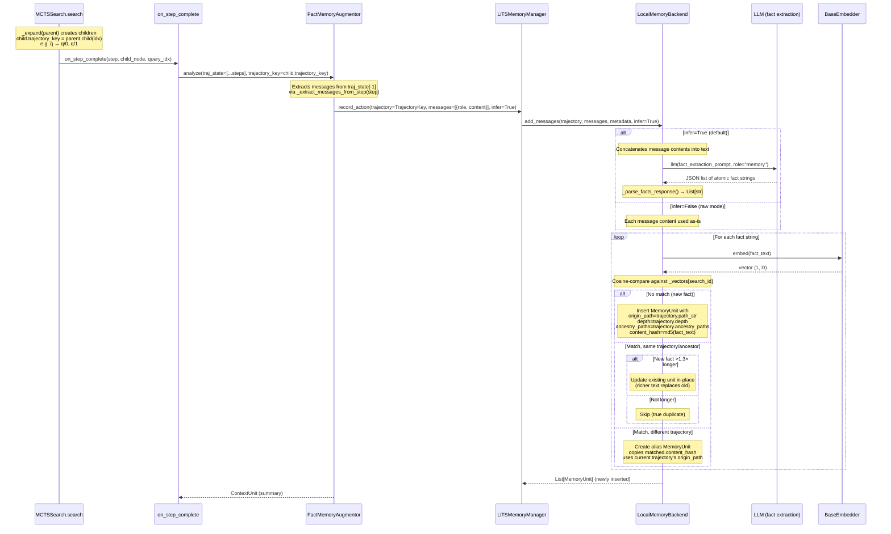

# LocalMemoryBackend

In-memory backend for `LiTSMemoryManager` with LLM fact extraction and embedding-based dedup. No external services required.

## Construction

```python
from lits.embedding import get_embedder
from lits.lm import get_lm
from lits.memory.backends import LocalMemoryBackend

llm = get_lm("bedrock/anthropic.claude-3-5-sonnet-20240620-v1:0")
backend = LocalMemoryBackend(llm=llm)  # default SentenceTransformer embedder

# Or with a Bedrock embedder:
embedder = get_embedder("bedrock-embed/cohere.embed-english-v3")
backend = LocalMemoryBackend(llm=llm, embedder=embedder)
```

| Param | Default | Description |
|---|---|---|
| `llm` | *(required)* | LiTS LLM for fact extraction |
| `embedder` | `get_embedder()` | Any `BaseEmbedder` (see [docs/embedding/EMBEDDING.md](../embedding/EMBEDDING.md)) |
| `dedup_threshold` | `0.85` | Cosine similarity threshold for dedup |
| `update_length_ratio` | `1.3` | Replace existing fact if new is >1.3× longer |

The embedder is loaded eagerly at construction (fail-fast). This is safe because `LocalMemoryBackend` is only constructed when memory is enabled (`config.enable_memory`).

## `record_action` Call Flow

Shows how MCTS triggers memory recording through the augmentor callback pipeline,
and how `TrajectoryKey` and messages flow through each layer.



The `TrajectoryKey` carries three pieces of information used by `_add_facts()`:
- `path_str` (e.g. `q/0/1`) → stored as `MemoryUnit.origin_path`
- `depth` (e.g. `2`) → stored as `MemoryUnit.depth`
- `ancestry_paths` (e.g. `("q", "q/0", "q/0/1")`) → used for inheritance filtering in `list_inherited_units()`

## Extraction Modes

### Infer mode (`infer=True`, default)

Concatenates message contents → sends to LLM with a fact-extraction prompt → parses JSON response into atomic fact strings.

### Raw mode (`infer=False`)

Each message's `content` is used directly as a fact. No LLM call. Useful for atomic tool outputs or when avoiding inference cost.

## Dedup Logic

Both modes feed facts into `_add_facts()`, which for each fact:

1. Embeds via `self._embedder.embed()`
2. Cosine-compares against all existing embeddings for the same `search_id`
3. If max similarity ≥ `dedup_threshold`:
   - Same trajectory/ancestor + new fact is longer → update in-place
   - Same trajectory/ancestor + not longer → skip
   - Different trajectory → create alias (copies content hash for `signature()` overlap)
4. Otherwise → insert as new `MemoryUnit`

## Storage Layout

Per `search_id`, two aligned structures:
- `_units[search_id]` — `list[MemoryUnit]`
- `_vectors[search_id]` — `np.ndarray (N, D)`

## Persistence

```python
backend.save("./memory_store")   # writes {search_id}.jsonl + {search_id}.npz
backend.load("./memory_store")   # restores into current instance
```

LLM and embedder are not serialized — pass them again at construction.

## Case Study: Two Thresholds in Cross-Trajectory Search

This example (from `unit_test/memory/test_manager_local_backend.py`, test 4) shows how
`dedup_threshold` and `similarity_threshold` interact when using `infer=True`.

### Setup

MCTS expands root → two children (q/0, q/1). Each child's step is recorded with `infer=True`.

- q/0 messages: *"The database contains three tables: users (id, name, email), orders (id, user_id, total, created_at), products (id, name, price, category)."*
- q/1 messages: *"The users table has columns id, name, and email. There are 150 users in the database."*

### Step 1: LLM fact extraction

The LLM extracts 7 atomic facts from q/0:

| # | Fact | origin_path |
|---|------|-------------|
| 0 | The database contains three tables | q/0 |
| 1 | There is a users table in the database | q/0 |
| 2 | The users table has columns: id, name, email | q/0 |
| 3 | There is an orders table in the database | q/0 |
| 4 | The orders table has columns: id, user_id, total, created_at | q/0 |
| 5 | There is a products table in the database | q/0 |
| 6 | The products table has columns: id, name, price, category | q/0 |

And 2 facts from q/1:

| # | Fact | origin_path |
|---|------|-------------|
| 7 | The users table has columns: id, name, email | q/1 |
| 8 | There are 150 users in the database | q/1 |

### Step 2: Embedding dedup (`dedup_threshold=0.85`)

When recording q/1's facts, `_add_facts()` compares each against q/0's existing embeddings:

- Fact 7 ("The users table has columns: id, name, email") matches fact 2 with cosine sim ≥ 0.85 → **alias created** (copies `content_hash` from fact 2, different `origin_path`)
- Fact 8 ("There are 150 users in the database") has no match above 0.85 → **new unit inserted**

Result: 1 shared `content_hash` between q/0 and q/1.

### Step 3: Cross-trajectory search (`similarity_threshold`)

`search_related_trajectories(q/0)` computes overlap score:

```
score = |shared content_hashes| / |q/0 content_hashes| = 1/7 ≈ 0.143
```

| `similarity_threshold` | Result |
|---|---|
| 0.3 (default) | **0 results** — score 0.143 < 0.3 |
| 0.1 | **1 result** — q/1 found, missing fact: "There are 150 users in the database" |

### Takeaway

Two thresholds control cross-trajectory discovery, and either can be the bottleneck:

1. `dedup_threshold` (embedding cosine sim): determines whether an alias is created at all. If the LLM produces slightly different phrasings across trajectories, the cosine sim may fall below this threshold, resulting in no shared `content_hash` and zero overlap.

2. `similarity_threshold` (overlap ratio): even when aliases exist, the overlap ratio can be low if one trajectory has many more facts than the other. With 7 facts in q/0 and only 1 shared, the score is ~14%.

For tool-use tasks where the LLM extracts many fine-grained facts per step, consider lowering `similarity_threshold` (e.g., 0.1) to allow cross-trajectory retrieval despite low overlap ratios.

## CLI Usage

`LocalMemoryBackend` is the default backend when using `--memory-arg`:

```bash
# Minimal (uses default SentenceTransformer embedder)
lits-search --dataset dbbench \
    --memory-arg backend=local \
        model=bedrock/us.anthropic.claude-sonnet-4-20250514-v1:0

# With Bedrock embedder and custom dedup threshold
lits-search --dataset dbbench \
    --memory-arg backend=local \
        model=bedrock/us.anthropic.claude-sonnet-4-20250514-v1:0 \
        embedding_model=bedrock-embed/cohere.embed-english-v3 \
        dedup_threshold=0.80
```

`--memory-arg` implicitly enables memory — no need for `--cfg enable_memory=true`.

See [docs/cli/search.md](../cli/search.md) for the full list of recognized keys.

## Limitations

- In-memory only; all data is lost when the process exits unless `save()`/`load()` is used
- `save()`/`load()` is not yet integrated into the CLI (manual persistence only)
