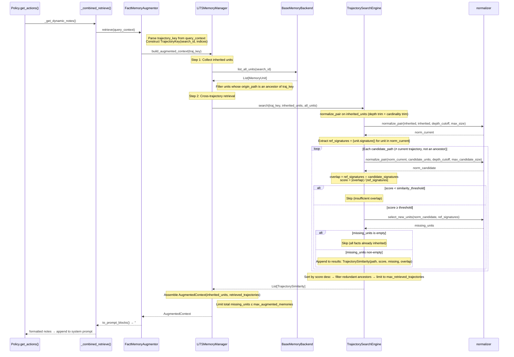
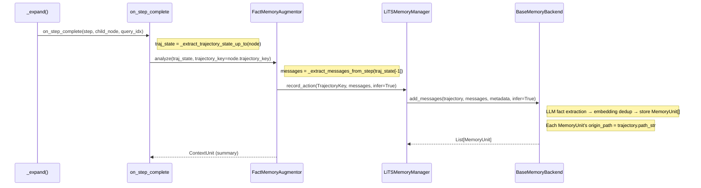

# TrajectorySearchEngine Architecture

`TrajectorySearchEngine` is the core engine for cross-trajectory retrieval in LiTS-Mem. This document shows how it interacts with the MCTS search loop, augmentor pipeline, memory manager, and backend.

## Class Relationship Overview

```
MCTSSearch.search()
  │
  ├── setup_augmentors() ──→ _combined_retrieve() closure
  │                              │
  │                              └── FactMemoryAugmentor.retrieve()
  │                                      │
  │                                      └── LiTSMemoryManager.build_augmented_context()
  │                                              │
  │                                              ├── .list_inherited_units()
  │                                              │       └── BaseMemoryBackend.list_all_units()
  │                                              │
  │                                              └── .search_related_trajectories()
  │                                                      └── TrajectorySearchEngine.search()
  │                                                              ├── normalize_pair()
  │                                                              └── select_new_units()
  │
  └── on_step_complete() ──→ FactMemoryAugmentor.analyze()
                                    │
                                    └── LiTSMemoryManager.record_action()
                                            └── BaseMemoryBackend.add_messages()
```

## Data Types

| Class | Module | Purpose |
|---|---|---|
| `TrajectoryKey` | `types.py` | Position identifier in the search tree (`search_id` + `indices`), e.g. `TrajectoryKey("q_0", (0, 1))` → path `q/0/1` |
| `MemoryUnit` | `types.py` | Stored atomic fact with `origin_path`, `content_hash`, `signature()` |
| `TrajectorySimilarity` | `types.py` | Retrieval result: `trajectory_path`, `score`, `missing_units`, `overlapping_units` |
| `AugmentedContext` | `manager.py` | Aggregated result: `inherited_units` + `retrieved_trajectories`, provides `to_prompt_blocks()` |

## Retrieve Flow (Prompt injection before expand)

Before each `Policy.get_actions()` call, `_dynamic_notes_fn` triggers `retrieve()` on all augmentors.
For `FactMemoryAugmentor`, the full call chain is:



## Record Flow (Store facts after transition)

After each child node completes transition in `_expand()`, `on_step_complete` triggers fact recording:



Recorded `MemoryUnit`s become available to `TrajectorySearchEngine.search()` for cross-trajectory matching in subsequent iterations.

## Normalizer Functions

| Function | Purpose | Called from |
|---|---|---|
| `normalize_pair(ref, cand, depth_cutoff, max_size)` | Depth trim + cardinality trim, returns `(norm_ref, norm_cand)` | `TrajectorySearchEngine.search()` |
| `select_new_units(candidate, existing_sigs)` | Implements `Sel(Mem(~t) | Mem(t))`: removes already-inherited facts | `TrajectorySearchEngine.search()` |

## Configuration (`LiTSMemoryConfig`)

| Parameter | Default | Effect |
|---|---|---|
| `similarity_threshold` | 0.35 | Lower bound on overlap score in `search()` |
| `max_retrieved_trajectories` | 3 | Max trajectories returned by `search()` |
| `cardinality_ratio` | 1.5 | `target_cardinality()` computes max candidate set size |
| `max_augmented_memories` | 16 | Upper limit on total missing_units in `build_augmented_context()` |
| `attach_depth_cap` | None | Depth trim cutoff (None = use current trajectory depth) |

## Case Study: Why `missing_units=0` Between Different Trajectories With Different Texts

### Symptom

Log output during MCTS with `FactMemoryAugmentor`:

```
[Memory] search: q/0 vs q/1: score=1.000 >= threshold=0.35 but missing_units=0 (all facts already inherited)
[Memory] retrieve: traj_key=q/0, search_id=q_0, inherited=5, retrieved_trajs=0, result_len=0
```

q/0 and q/1 are sibling trajectories solving the same problem. The search engine finds perfect overlap (`score=1.0`) yet returns nothing. Why?

### Root Cause: Signature Overlap via Backend Dedup

`TrajectorySearchEngine.search()` is backend-agnostic — it only compares `MemoryUnit.signature()` values. The `select_new_units()` function removes any candidate unit whose signature already exists in the current trajectory's reference set. If every candidate unit's signature matches a reference unit, `missing_units` is empty.

How signatures end up matching depends on the backend:

- `LocalMemoryBackend`: When recording q/1's facts, `_add_facts()` computes cosine similarity against q/0's existing embeddings. If a q/1 fact is semantically similar (cosine sim ≥ `dedup_threshold`), an **alias** is created — a new `MemoryUnit` with `origin_path=q/1` but the matched q/0 unit's `content_hash`. Since `signature()` returns `content_hash` when available, the alias has the same signature as the original.

- `Mem0MemoryBackend`: mem0's internal dedup assigns the same `hash` to semantically equivalent facts. The `_point_to_unit()` method reads this as `content_hash`, producing the same effect.

### Walkthrough (from actual test output)

MCTS solves "Janet's ducks lay 16 eggs per day..." with `n_actions=2`. After expanding root → q/0 and q/1, the backend contains:

```
origin   hash      text
q/0      143e395f  Janet's chickens lay 16 eggs per day.
q/0      6ce32a04  Janet eats 3 eggs for breakfast.
q/0      378d46f6  Janet uses 4 eggs for muffins.
q/0      9e9ff4d8  Janet has 9 eggs available to sell...
q/0      4b5c4da7  The number of eggs available to sell is calculated by subtra...
q/1      143e395f  Janet's chickens lay 16 eggs per day.          ← alias
q/1      6ce32a04  Janet eats 3 eggs for breakfast.               ← alias
q/1      378d46f6  Janet uses 4 eggs for muffins.                 ← alias
q/1      9e9ff4d8  Janet has 9 eggs available to sell...          ← alias
q/1      4b5c4da7  The number of eggs available to sell is...     ← alias
```

All 5 q/1 units are aliases sharing q/0's `content_hash`. When `search()` runs for q/0:

```
ref_signatures  (q/0) = {143e395f, 6ce32a04, 378d46f6, 9e9ff4d8, 4b5c4da7}
cand_signatures (q/1) = {143e395f, 6ce32a04, 378d46f6, 9e9ff4d8, 4b5c4da7}  (same)

overlap = 5/5 → score = 1.0
select_new_units() removes all 5 → missing_units = 0
```

### When Does Cross-Trajectory Retrieval Actually Help?

The retrieval produces non-empty `missing_units` when trajectories **diverge** — one discovers facts the other hasn't. This happens when:

1. Trajectories reach different depths (e.g., q/0 has 2 steps, q/1 has 1 step — q/0's deeper facts are new to q/1)
2. The LLM extracts genuinely different facts from different reasoning paths
3. Tool-use tasks where different tool calls produce different environmental observations

For simple math problems where both trajectories extract the same facts at the same depth, full aliasing and `missing_units=0` is expected and correct — there is nothing new to inject.

### Verification (in pdb)

Run `python -m unit_test.components.context_augmentor.test_fact_memory_mcts` from `lits_llm/`.
At the step 7 breakpoint (`# inspect: len(backend._units['q_0'])`), type:

```python
# Dump all units showing content_hash sharing:
p [(u.origin_path, u.content_hash[:8], u.text[:60])
   for u in fact_augmentor.memory_manager.backend.list_all_units("q_0")]

# Count unique hashes per trajectory:
units = fact_augmentor.memory_manager.backend.list_all_units("q_0")
from collections import Counter
p Counter(u.origin_path for u in units)
# e.g. Counter({'q/0': 5, 'q/1': 5, 'q/0/0': 9, 'q/1/0': 4, 'q/1/1': 4})

# Check if q/1 hashes are a subset of q/0 hashes:
q0_hashes = {u.content_hash for u in units if u.origin_path == 'q/0'}
q1_hashes = {u.content_hash for u in units if u.origin_path == 'q/1'}
p q1_hashes.issubset(q0_hashes)  # True → all aliases, missing_units will be 0
```
